# Top 14 Email Verification Tools Ranked in 2025 (Fresh Compilation)

Sending emails to dead addresses tanks your sender reputation faster than you can say "bounce rate." Every invalid email on your list pushes your deliverability scores lower, making even your legitimate messages disappear into spam folders or never arrive at all. Smart teams verify their contacts before hitting send, catching syntax errors, disposable addresses, spam traps, and inactive mailboxes that sabotage email campaigns.

The right email validation platform does more than just clean lists—it protects your domain reputation, improves inbox placement rates, and makes every marketing dollar count. Whether you're running cold outreach campaigns, managing subscriber databases, or building signup forms, these tools catch problems at the source so your messages actually reach real people. Below are fourteen platforms that handle everything from bulk list cleaning to real-time API verification, ranked by their overall value for businesses of any size.

---

## **[Bouncer](https://www.usebouncer.com)**

Your go-to solution for fast, accurate email validation with the cleanest output in the industry.

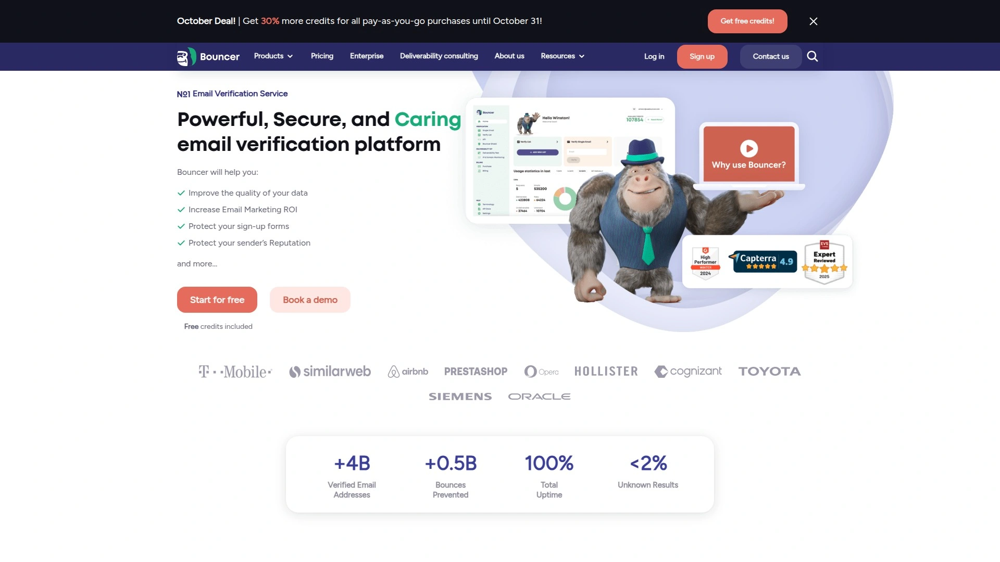

Bouncer combines powerful verification technology with an interface so simple it feels effortless. The platform processes lists quickly—5 minutes for standard batches—while maintaining accuracy rates that keep bounce rates below 1%. What sets Bouncer apart is its deep catch-all verification capability, which most competitors struggle with, plus toxicity scoring on a 0-5 scale that identifies risky addresses like spam traps, complainers, and breached emails.

The deliverability kit goes beyond basic verification, testing inbox placement across major providers, checking authentication protocols (SPF, DKIM, DMARC), and monitoring blocklists in real-time. For businesses that need immediate protection, Bouncer Shield blocks fraudulent signups at form entry without requiring any coding, filtering by both email characteristics and IP address.

**Email Engagement Insights** reveal last open dates, click activity, reply history, unsubscribe events, and bounce types, helping teams segment lists and prioritize active contacts. Pay-as-you-go pricing starts at $8 per 1,000 verifications, with monthly subscriptions dropping that to $6.40. The platform offers 100 free credits upfront and integrates directly with popular marketing platforms to automate list cleaning.

Best for: Teams that need top-tier accuracy with detailed risk analysis, plus anyone dealing with catch-all domains that other services can't verify.

***

## **[ZeroBounce](https://www.zerobounce.net)**

Built for marketers who demand 99% accuracy and comprehensive deliverability protection.

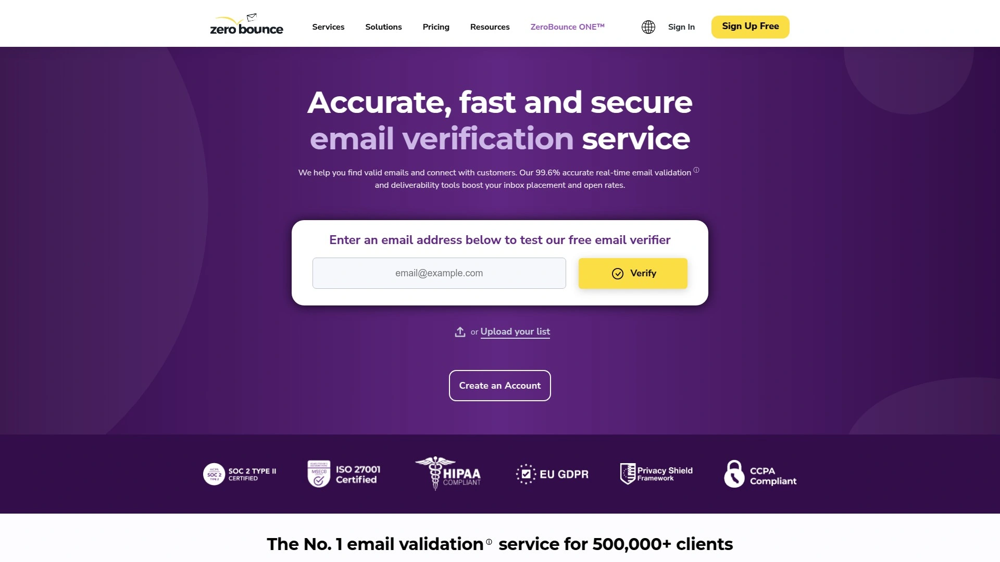

ZeroBounce runs extensive checks across every address, detecting over 30 email types including invalid, abuse, disposable, spam traps, toxic domains, and catch-all addresses. The platform processes 100,000 emails in roughly 110 minutes with accuracy rates consistently hitting 98-99%. Its real-time API validation lets you protect forms, comments sections, and eCommerce checkouts from fraudulent entries before they hit your database.

The service includes an AI-powered scoring system that evaluates email address quality and engagement potential, helping prioritize outreach efforts. Monthly plans start at $18 for 2,000 emails, with pay-as-you-go options at $20 per batch. Every new account receives 100 free verifications to test the system. ZeroBounce maintains ISO 9001 and ISO 27001 compliance, with full GDPR adherence and EU-based data hosting.

Chrome extension users can verify addresses directly from any webpage, with 100 monthly verifications included. The platform integrates seamlessly with WordPress, WooCommerce, Contact Form 7, WPForms, Ninja Forms, and major ESPs like Mailchimp and HubSpot.

Best for: Established businesses running high-volume email campaigns who need enterprise-grade security and detailed email type detection.

***

## **[NeverBounce](https://www.neverbounce.com)**

The speed champion for teams that need instant results without sacrificing accuracy.

NeverBounce validates email lists against a database of 6 billion addresses, achieving 98-99% accuracy while processing 100,000 emails in approximately 45 minutes. Real-time verification happens in 3-10 minutes for batches up to 10,000 addresses. The platform categorizes results into clear statuses: valid (safe to send), accept-all (requires review), invalid (hard bounce), and disposable (temporary addresses).

The service removes outdated addresses automatically and helps businesses maintain strict ESP compliance requirements. API integration enables instant verification at the point of email capture through signup forms, contact forms, lead generation, and mobile apps. Pricing starts at $50 for 10,000 pay-as-you-go verifications with no monthly minimums.

Over 125,000 users rely on NeverBounce for its combination of speed and reliability. The platform provides webhook support and JavaScript widgets for flexible implementation across any tech stack. Customer support includes dedicated account managers for high-volume users who need assistance optimizing verification workflows.

Best for: Fast-growing startups and agencies that process large volumes quickly and need bulletproof API reliability.

***

## **[Hunter.io](https://hunter.io)**

The all-in-one platform that finds, verifies, and manages professional email addresses in one place.

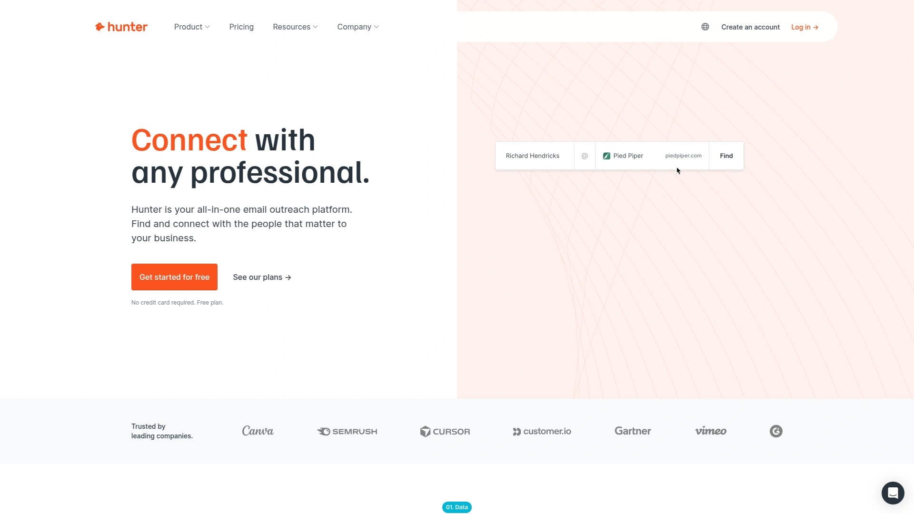

Hunter.io Email Verifier performs comprehensive checks including syntax validation, domain information analysis, SMTP server connection tests, and risk assessment—all without sending actual emails. The tool achieves 98% accuracy and typically maintains bounce rates below 1% for verified addresses. Users can verify single addresses instantly through the free checker or process entire lists with the Bulk Email Verifier.

The platform categorizes emails into five clear statuses: valid (safe to send), accept-all (catch-all domains), invalid (hard bounce), disposable (temporary), and unknown (verification blocked by server). Hunter's database includes millions of verified professional contacts, making it valuable for prospecting and outreach beyond just verification.

Pricing starts at $34 for 5,000 pay-as-you-go verifications, with API access included for all users. The service provides 50 free credits monthly with no signup required for single-address checks. Integration options cover most popular CRMs and marketing platforms, including native HubSpot and Salesforce connections.

Best for: Sales teams and growth hackers who need prospecting tools bundled with verification capabilities.

***

## **[Emailable](https://emailable.com)**

Budget-friendly verification with generous free credits and blazing-fast processing speeds.

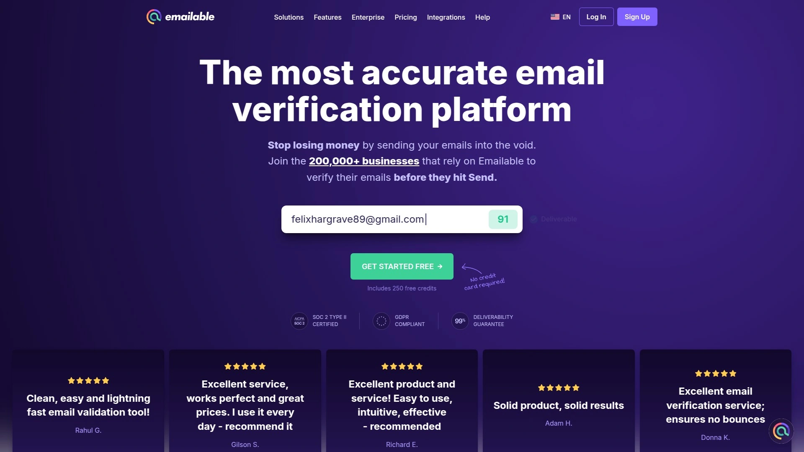

Emailable stands out by offering 250 free verification credits upfront—more than double what most competitors provide. The platform processes 100,000 emails in just 2-3 minutes, making it one of the fastest services available. Accuracy sits at 95% with bounce rates consistently below 1%, and the system comes with a 99% deliverability guarantee plus 24/7 customer support.

The interface makes importing email lists effortless, with direct integrations to popular marketing platforms for automated cleaning. Users can choose between credit packages or monthly subscription plans, with 5,000 emails costing $38 on pay-as-you-go pricing. Flexible pricing options make Emailable attractive for businesses with variable verification needs or seasonal campaigns.

The platform struggled with Yahoo addresses in testing, and some users report difficulty interpreting certain email statuses. However, the modern, easy-to-navigate interface and budget-friendly approach compensate for these minor limitations.

Best for: Small businesses and solopreneurs who need generous free credits and flexible pricing without long-term commitments.

---

## **[MillionVerifier](https://www.millionverifier.com)**

Never-expiring credits and aggressive pricing for teams that verify sporadically.

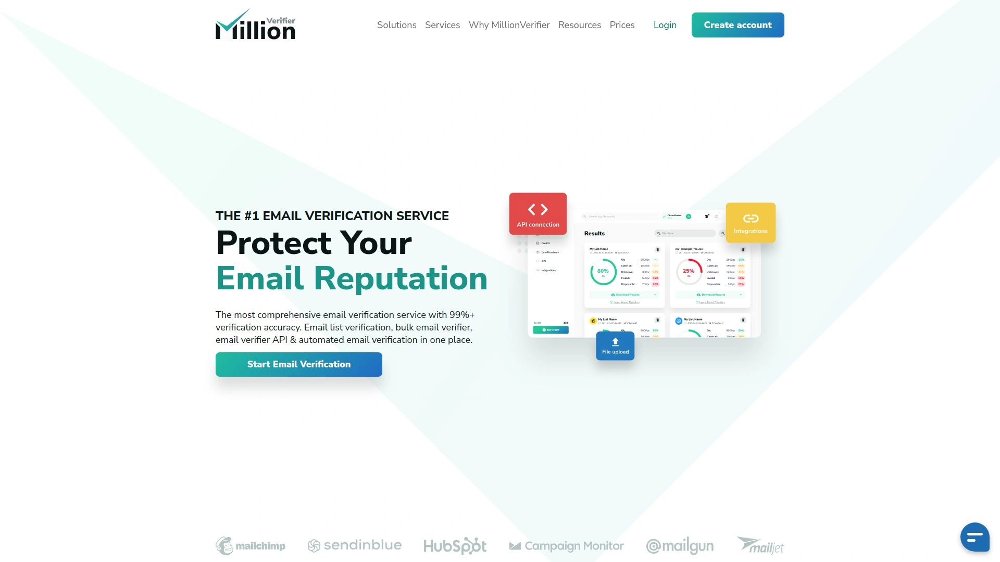

MillionVerifier (formerly HuBoCo) offers a unique never-expiring credit system—you buy once and use whenever needed, with no monthly subscriptions or expiration dates. The platform achieves 99% accuracy and processes 100,000 emails in 33-78 minutes depending on list complexity. Users can upload files, copy-paste addresses directly into the dashboard, or integrate the verification API into websites and apps for real-time validation.

The real-time API automatically validates email addresses as users submit them on forms, reducing bounce rates before problematic contacts enter your database. The platform calculates pricing instantly—just enter how many emails you need verified and the cost appears immediately. For 10,000 emails, expect to pay approximately $37 as a one-time purchase.

Integration with email marketing platforms automates list cleaning, making MillionVerifier popular among email marketers who want set-it-and-forget-it maintenance. The service struggled with catch-all and Yahoo domains in testing, and customer support isn't available 24/7.

Best for: Businesses with irregular verification needs who want to avoid monthly fees and prefer permanent credits.

***

## **[Clearout](https://clearout.io)**

Comprehensive validation with 20+ verification layers and powerful enrichment features.

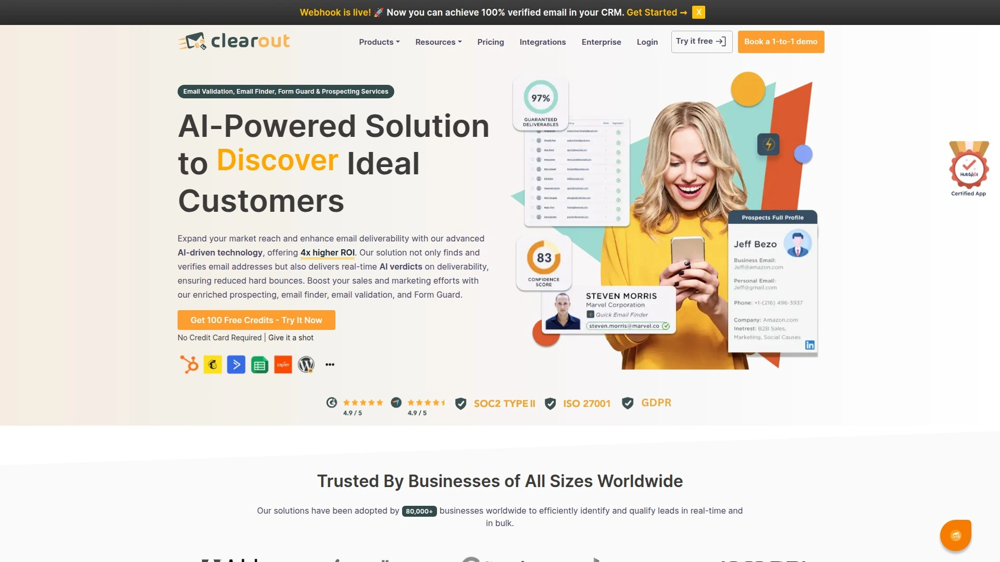

Clearout performs over 20 refined checks on every email address, including greylist verification, anti-spam analysis, gibberish detection, catch-all verification, email blacklist screening, and temporary address identification. The platform achieves 98%+ accuracy and processes 100,000 emails in roughly 45 minutes. Pricing starts at $35 for 5,000 pay-as-you-go verifications, with 100 free credits included for new accounts.

The service offers email finder and sales prospecting capabilities beyond basic verification, helping teams build and validate contact lists simultaneously. Real-time validation blocks invalid entries—including temporary, disposable, and alias addresses—at the moment of form submission. Users can customize blocking rules to reject free email providers like Gmail, Yahoo, and Hotmail for B2B list building.

Chrome extension and Google Sheets add-on provide convenient verification directly within existing workflows. The Google Sheets integration allows bulk verification without leaving spreadsheets, with real-time results and automatic duplicate removal. Integration options include HubSpot, WordPress, Jotform, and most major marketing platforms.

Best for: B2B companies that need strict email validation rules plus prospecting tools in one platform.

---

## **[Kickbox](https://kickbox.com)**

Enterprise-focused verification with proprietary Sendex™ scoring for deliverability prediction.

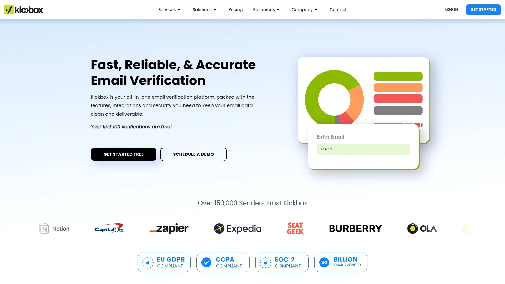

Kickbox uses both API and drag-and-drop methods to verify emails, providing four clear result statuses: deliverable (confirmed active), undeliverable (does not exist), risky (potentially low quality), and unknown (server response failed). The proprietary Sendex™ Score measures each email address's quality and engagement potential on a 0-100 scale. Over 26 billion emails have been verified through the platform, demonstrating enterprise-scale reliability.

The verification process happens quickly with high accuracy, and the platform offers robust data security with compliance across various international regulations. Free trial includes up to 100 verifications, with simple pay-as-you-go pricing thereafter. Integration capabilities extend to major ESPs and CRM platforms including Gravity Forms, HubSpot, and Customer.io.

Kickbox automatically detects typos in email addresses and provides correction suggestions, preventing accidental bounce-backs from simple mistakes. Some users report slower customer support response times, and the spam detection capabilities could be stronger compared to competitors.

Best for: Medium to large businesses prioritizing data security, regulatory compliance, and predictive engagement scoring.

***

## **[EmailListVerify](https://www.emailvendorselection.com/email-verification-tools/)**

No-frills specialist service focused purely on validation with impressive affordability.

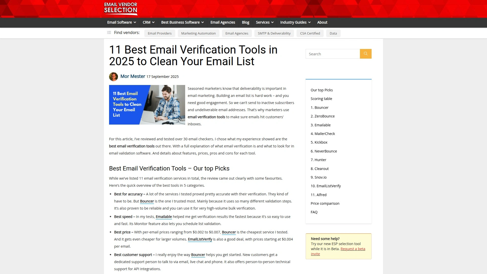

EmailListVerify concentrates exclusively on email verification, using multiple test layers including syntax verification, MX record detection, spam trap identification, domain health analysis, and detection of disposable/temporary addresses. The focused approach helps achieve impressive accuracy at budget-friendly prices—starting at just $0.0004 per email for 1,000 verifications. Bulk discounts drop the cost as low as $0.0003 per email for larger volumes.

Monthly subscription plans start at $139/month for 5,000 daily verifications, suitable for agencies and high-volume senders. The service provides 100 free verifications upfront to test performance. Free deliverability tools include blacklist checker, DNS health check, MX lookup, DMARC record generator, and SPF record generator—all accessible without credits.

Eleven integrations connect EmailListVerify with popular email marketing services including AWeber, Kit, HubSpot, Mailchimp, and SendGrid. The user interface could be more modern compared to newer competitors, but the functionality remains solid.

Best for: Cost-conscious businesses that want reliable verification without paying for extra features they won't use.

***

## **[MailerCheck](https://www.mailercheck.com)**

Comprehensive deliverability testing platform combining verification with DMARC monitoring and inbox placement analysis.

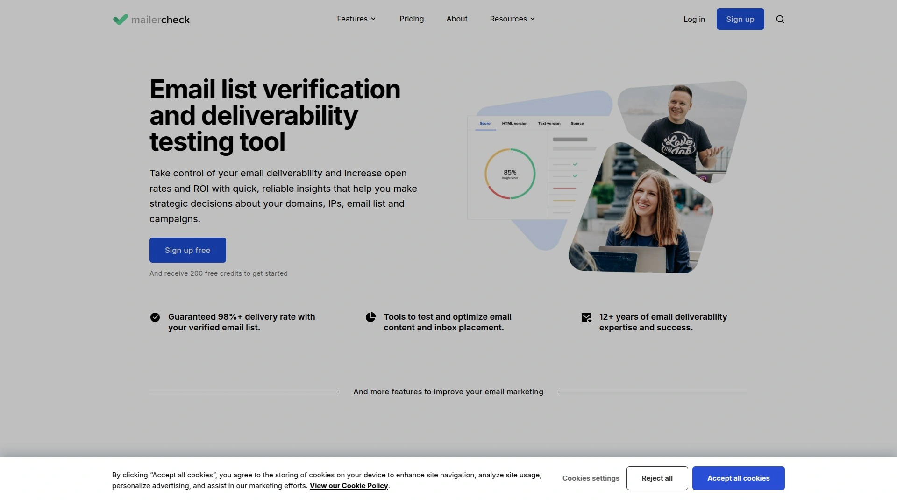

MailerCheck goes beyond basic verification by bundling real-time email validation with DMARC monitoring, blocklist alerts, and inbox placement testing. The platform achieves 98-99% verification accuracy and provides detailed usage reports showing exactly where email quality issues originate. Users receive 200 free credits upon signup—among the most generous free trials available.

The service validates new email addresses instantly through API integration as they're collected via signup forms, preventing bad addresses from ever entering your database. Email content testing identifies potential spam triggers before campaigns launch, while inbox placement tests show whether messages land in Inbox, Spam, or Promotions folders across Gmail, Outlook, and other providers.

Pricing starts at $45 for 5,000 pay-as-you-go verifications, or $125/month for the Basic plan including 10 DMARC domains and 66 blocklist monitors. Integration with major platforms like Mailchimp, Zapier, and MailerLite enables automated workflows. The interface stays intuitive and effective, though pricing runs higher than simpler validation-only services.

Best for: Email marketers who need complete deliverability monitoring beyond just address validation.

---

## **[Snov.io](https://snov.io)**

Multichannel prospecting platform with built-in verification for cold outreach campaigns.

Snov.io combines email finding, verification, and cold outreach automation in one platform, making it popular among sales teams running multichannel campaigns. The email verifier achieves 98% accuracy and comes bundled with LinkedIn prospecting tools, automated drip campaigns, and detailed analytics tracking. Monthly pricing starts at $30 for 1,000 emails, with 50 free verification credits included for new users.

The platform's strength lies in its unified workflow—users can find leads, verify their contact information, and launch personalized outreach sequences without switching between tools. Real-time verification API prevents invalid addresses from entering CRM systems during lead capture. Integration capabilities extend to popular CRMs, enabling automatic data syncing and list updates.

Processing speed remains undisclosed in official documentation, but user reviews indicate reliable performance for small to medium batch sizes. The platform serves teams that value having prospecting and verification capabilities tightly integrated rather than managing separate services.

Best for: Sales development reps and business development teams running targeted cold outreach campaigns across multiple channels.

***

## **[Email Hippo](https://www.emailhippo.net)**

Security-focused validation with ISO compliance and comprehensive analysis against 74 deliverability factors.

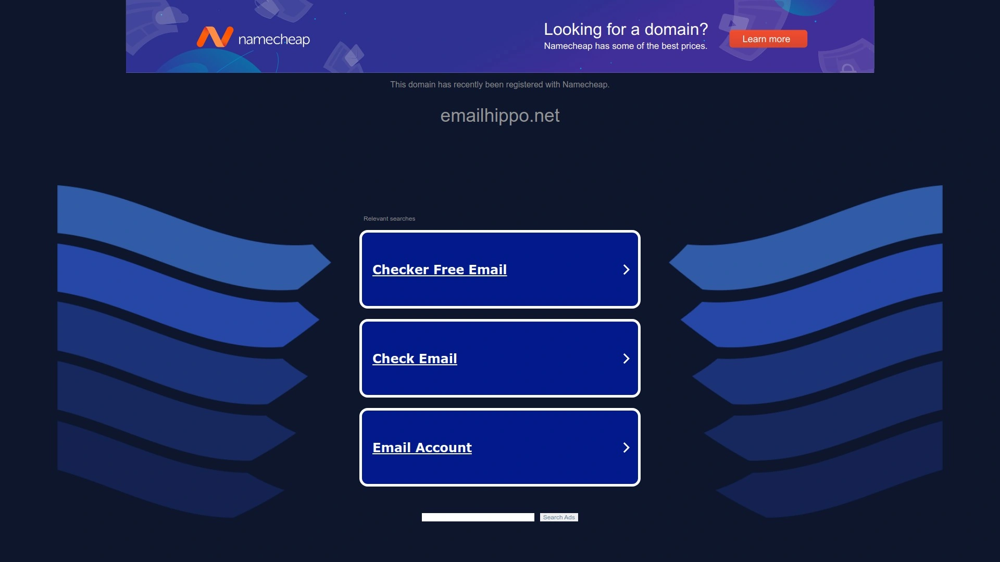

Email Hippo analyzes email lists against 74 different deliverability factors, promising 98% accuracy and 99.99% uptime. The service holds ISO 9001 and ISO 27007 compliance certifications, demonstrating commitment to quality management and security practices. New users receive 100 free email verifications upon signup, with a quick single-address verification tool available on the website without registration.

Pay-as-you-go pricing starts at $9 per file, with bulk list processing calculated dynamically. For a 2,000-subscriber list, expect to pay approximately $19.76, while monthly plans begin at $9.88/month for 1,000 emails, jumping to $24.70 for up to 2,500 emails. The dashboard provides clear navigation once logged in, making list management straightforward.

Processing speed lags behind competitors—verification took 9 minutes in testing, making it the slowest option evaluated. Additionally, 13% of test list addresses couldn't be verified, higher than industry averages. Pricing information on the website could be clearer, though the logged-in experience improves transparency significantly.

Best for: Organizations with strict security and compliance requirements who prioritize ISO certification over processing speed.

---

## **[Saleshandy Email Verifier](https://www.saleshandy.com/blog/email-verification-tools/)**

Complete cold email platform with verification, lead finding, and deliverability monitoring built in.

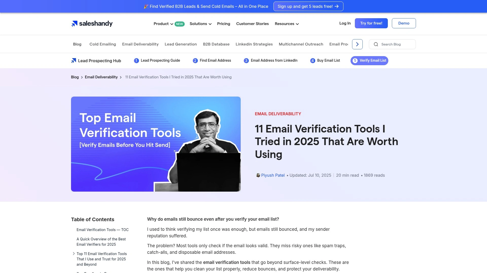

Saleshandy Email Verifier runs 24 validation checks on every address, detecting valid emails, catch-all domains, role-based addresses, disposable/invalid emails, syntax errors, and inactive mailboxes. Results appear in clear categories: Deliverable, Undeliverable, Accept-All, Role-Based, Disposable, or Unknown, with no charges for unknown results. The platform achieves 98% accuracy and processes 100,000 emails in 45 minutes.

What makes Saleshandy unique is the Inbox Radar feature, which shows whether emails land in Inbox, Spam, or Promotions folders across Gmail, Outlook, Zoho, and other ESPs. This helps catch deliverability problems before wasting verified contacts on broken email setups. Users receive 50 free monthly verification credits with no card required, making it easy to test the service.

The platform includes a 700M+ B2B lead database for prospecting, AI-powered cold email sequence writing, built-in analytics tracking, and unlimited email account connections for outreach scaling. Pricing starts at $19/month for 5,000 leads. Full compliance includes GDPR, SOC 2 Type II, and ISO 27001 certifications.

Best for: Cold email senders who want verification, prospecting, sending, and deliverability monitoring in one platform.

***

## **[Bulk Email Checker](https://bulkemailchecker.com)**

Straightforward online verification service used by thousands of businesses daily for no-nonsense list cleaning.

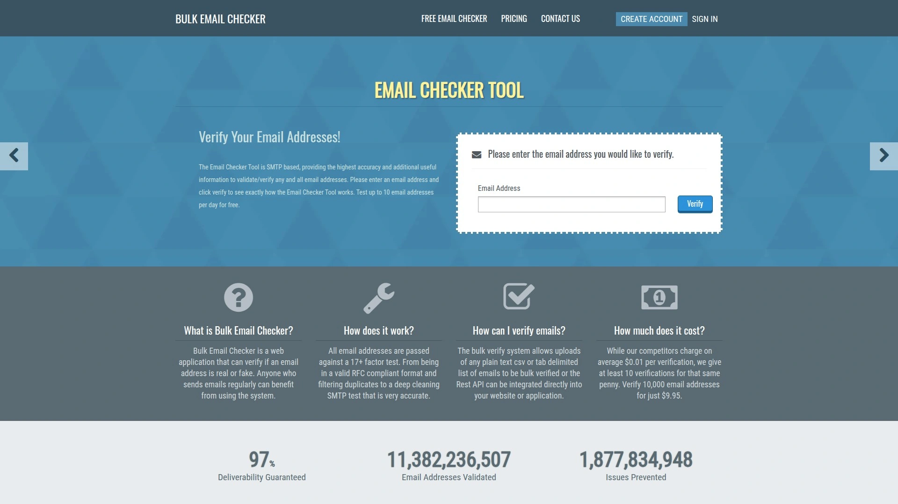

Bulk Email Checker provides a simple, reliable email validation service focused on essential cleaning tasks without complicated features. The platform has earned trust from thousands of businesses that use it daily for routine list maintenance. The service emphasizes ease of use—upload your list, wait for processing, and download cleaned results.

The straightforward approach makes Bulk Email Checker accessible for teams without technical expertise or those who prefer minimal setup overhead. No complex dashboards, excessive configuration options, or bundled features that inflate costs. Just core verification functionality that works consistently.

Pricing and processing speed details aren't prominently featured on the website, suggesting a more traditional, inquiry-based sales approach. The platform likely appeals to businesses that value simplicity and proven reliability over cutting-edge features or rock-bottom pricing.

Best for: Traditional businesses that want proven, hassle-free verification without learning complex platforms or managing API integrations.

***

## What's the fastest way to verify a large email list?

Upload your list to platforms like **Emailable** (100,000 emails in 2-3 minutes) or **NeverBounce** (100,000 in 45 minutes) for rapid bulk processing. Most services provide downloadable results immediately after verification completes, letting you filter deliverable addresses and remove problematic ones before importing to your ESP. For ongoing protection, integrate real-time API verification from **Bouncer**, **Clearout**, or **MailerCheck** directly into your signup forms to stop invalid entries at the source.

## How often should I clean my email list?

Re-verify your entire list every 3-6 months since email addresses decay at roughly 22.5% annually through job changes, domain expirations, and abandoned accounts. Run verification before every major campaign launch to catch recent changes that could spike your bounce rate. Enable real-time verification on all forms to prevent new invalid addresses from entering your database, reducing the need for frequent bulk cleaning.

## Can email verification prevent all bounces?

No verification service guarantees zero bounces because factors beyond address validity affect delivery—including sender reputation, authentication setup, content quality, and recipient server policies. Verified "valid" addresses typically produce bounce rates below 1%, but temporary server issues, full mailboxes, or aggressive spam filters can still reject messages. Combine verification with proper email authentication (SPF, DKIM, DMARC), consistent sending patterns, and engaged list hygiene for best results.

***

When your sender reputation is on the line, **[Bouncer](https://www.usebouncer.com)** delivers the accuracy and toxicity insights that keep your domain trusted by inbox providers. The platform's deep catch-all verification and Email Engagement Insights make it especially valuable for teams running cold outreach or managing aging contact databases where other services struggle. Start with 100 free credits to see how clean verification results directly improve your campaign performance and inbox placement rates.
